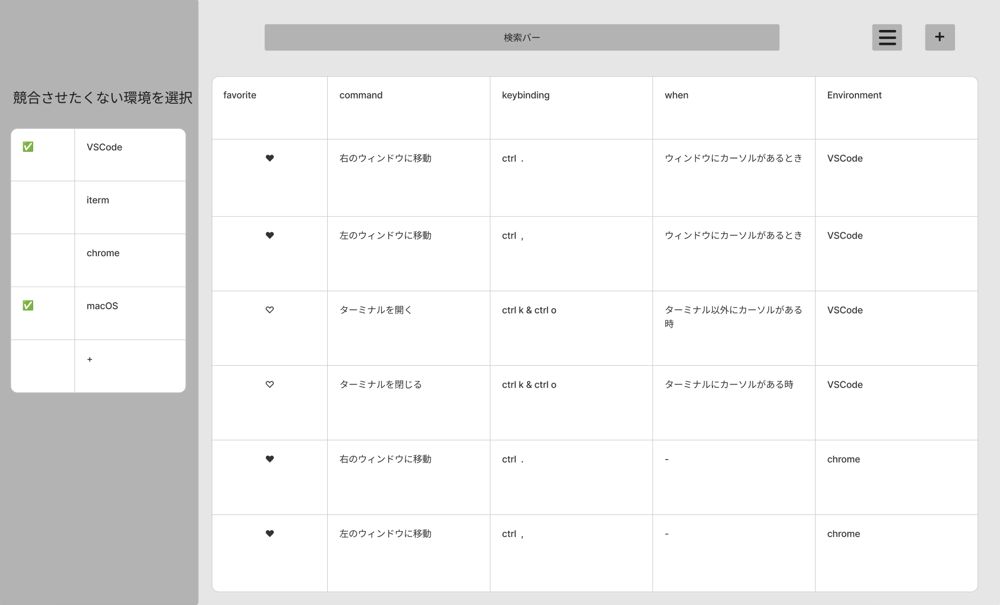
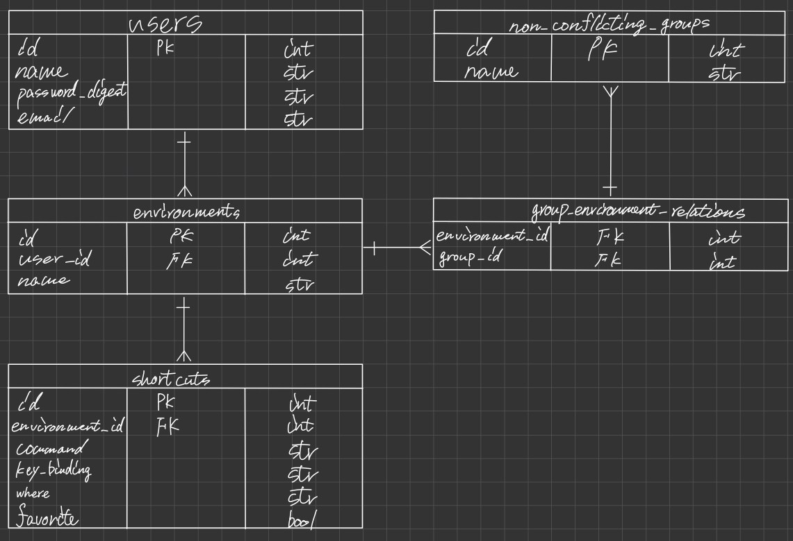

# original product

## プロダクト概要
ショートカット作成時，  
競合を生まないショートカットを楽に探したい人のための  
shortcuts manager (仮) は  
ショートカット管理アプリです.  

これは 競合するショートカットを作成しようとしたらアラートを出す ことができ，  
CheatSheetやKeyCueとは違って，  
異なるプラットフォームでのショートカットの競合も検知することができます．  
例えば，システムに cmd + c (copy)が登録されているのに，ブラウザで同じキーに新しくショートカットを割り当てようとすると警告を発します．

## プロダクト詳細
### メイン機能 ショートカット登録
1. ログインする
1. サイドバーからショートカットを競合させたくない環境を選択する  
（例えば，VSCodeとOSで競合を許さない．  
VSCodeとchromeは競合を許すなど．  
下の場合，VSCodeとmacOSが競合すると警告を鳴らす）

1. 画面右上の十字ボタンをクリックするとモーダルウィンドウのフォームが出現する  
keybiding以外の項目を入力する  

1. keybidingをクリックして，追加したいキーを入力する.  
例えば，ctrl + 他のキー　で作成したいとき，  
ctrlをしている間，下のようにカラーリングされる，  
この時，青いキーはショートカットが競合しないので  
ctrl + kを入力してreturnを押すと登録が完了する．  
tmuxなどの場合，初期状態で全てのキーにショートカットが登録されているのでお気に入り機能があると，競合が起こるが使っていないキーの黄色と，使っている赤で色分けすることができる．

### 課題
1. 新しくショートカットを作成するとき，どこに割り当てれば競合をなくせるかを楽に知りたい．
1. 既存のショートカット管理ツールは異なるプラットフォーム間でのショートカットを一括管理できない．(VSCode，ブラウザ，vim，OSなど)
1. CheatSheetなどのショートカット管理ツールはデフォルトで登録されているショートカットしか表示できない
1. KeyCueなどのリッチなショートカット管理アプリは，項目が多すぎて使いにくい，また異なるプラットフォームでの重複を検知できない
1. 日本語に対応しているツールが少ない

### テーマ
新しく作成するショートカットのキー選びを楽にする．

### コンセプト
これまでのショートカット管理アプリでは，異なるプラットフォームでのショートカットの重複を検知できなかった．  
そのため，システムに cmd + c (copy)が登録されているのに，ブラウザで同じキーに新しくショートカットを登録して競合を生んでしまう．という問題があった．  
このアプリでは新しいショートカット作成時の「競合を起こさないキーを試行錯誤する手間」をグッと削減できます．

### ソリューション 
1. 複数のプラットフォームでのショートカットを一括でかつシンプルに管理する.
1. ショートカット登録の際に競合するキーをわかりやすいUIで示す．

### ペルソナ
#### ペルソナ1：自分

**アプリの使用理由**
利用しているほぼ全てのツールで大量にショートカットを作成しているので競合を起こさないキーを探すのに手間がかかっている

**ショートカット使用頻度**
ほぼ全てのツールを自分好みにカスタマイズしている  

### 機能
#### 必須
* ショートカット登録
* ショートカット削除
* 登録の際，競合が出たらアラート
* 使用していないキーセットを表示
#### できたら良い
* デフォルトのショートカットがすでに登録されている機能
* よく使うショートカット（お気に入り）の登録
* ~/.config/nvim/init.vimなどのショートカット管理ファイルから一括で登録
* このアプリでショートカットを作成して，コンフィグファイルに入力するコードを作成する
* 覚えたいショートカットの登録
* ショートカットのクイズ
### 工夫する点 
* シンプルで楽にショートカットを登録できる
* 異なるプラットフォームでのショートカットの競合を検知できるように設計する
### このアプリの強み
* ショートカットを一括で管理できる
* 使用していないショートカットキーがわかりやすい
* 使用していないショートカットがわかりやすく，シンプルで使いやすい
### このアプリの弱点
* すでにショートカットを多用している人が，ショートカットを登録するのが大変

# 画面図
[figma](https://www.figma.com/board/jjMGHVcHFyKo6RE1qIp98p/keyboard-manager?node-id=0-1&t=iNUAdEzjnmch7nV6-0)

# DB
### ER図

### 改善項目
* デフォルトショートカットが初めから登録されている機能を追加するならEnvironmentテーブルが必要

# UI
#### ホーム画面

#### ログイン画面

#### サインアップ画面

#### お気に入り登録

#### 表示環境切り替えボタン

#### モーダルのトグル

# 参考ページ
[リアルタイムでキーボードの動作を反映させる機能を利用しているアプリ](https://www.onlinemictest.com/ja/keyboard-test/)
